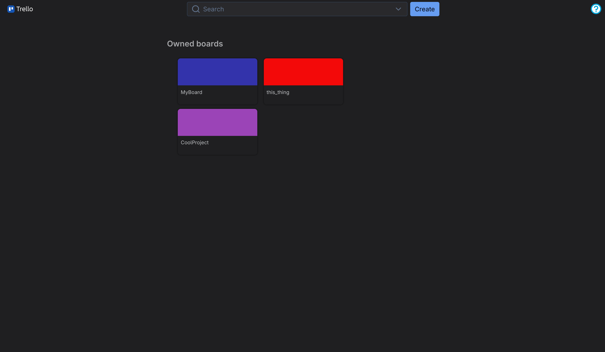
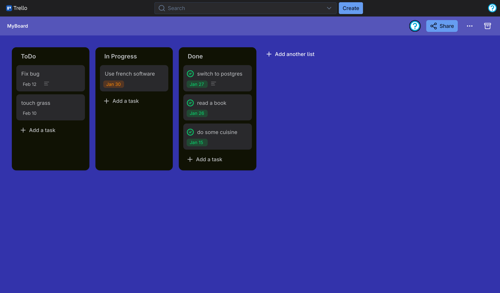

# EpiTrello

> This is a School Project

```
EpiTrello aims to improve team organization and the visibility of tasks to be completed.
The tool will be accessible via a simple and intuitive web interface.
The goal is not to create a product that is more comprehensive than other boards,
but to develop a product that can be used for a simple task: organizing by breaking
down a mission into tasks and placing them on a board divided into several categories.
```





## Set up

For the following steps, you must have cloned this repository and open a terminal in it.

```bash
git clone https://github.com/adelaidechanteux/EpiTrello EpiTrello && cd $_
```

### 1 - Edit env vars

```bash
mv ./environment/override_example.env ./environment/override.env
```

> edit the file ./environment/override.env

```bash
mv ./environment/postgres_example.env ./environment/postgres.env
```

> edit the file ./environment/postgres.env

### 2 - Edit the google project

> edit the file ./frontend/nuxt.config.ts and change the value of `googleSignIn.clientId`

### 3 - Edit the compose file

> customize the file ./compose.yml

### 4 - launch the project

```bash
docker compose up
```
